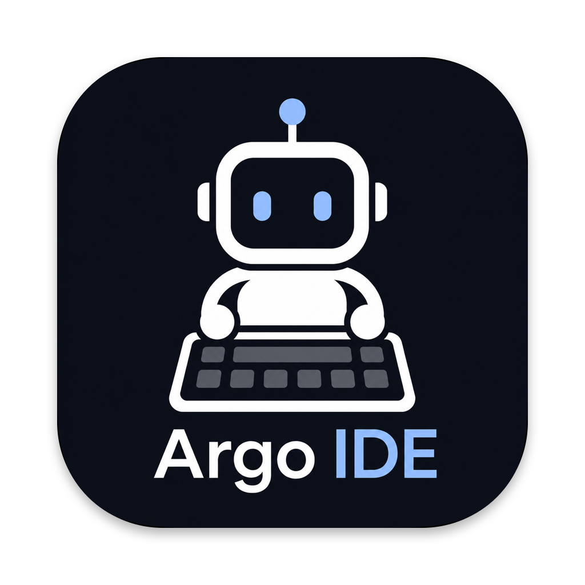
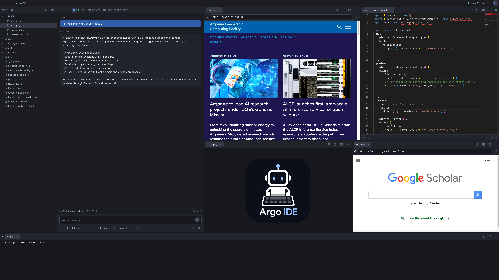

#  Argo-IDE

A desktop IDE for working alongside the [Argo](https://apps.inside.anl.gov) API, built for macOS. Support for other operating systems is currently in development.

# 

## Why Argo-IDE?

- **Simple and intuitive** — A clean three-pane layout keeps the AI Agent at the center of your workflow.
- **Built specifically for Argo users** — Access all available Argo models through one unified, user-friendly interface.
- **Context-aware assistance** — The AI Agent understands the project directory you are working in.
- **Everything in one place** — An integrated AI Agent, file explorer, code editor, web browser, and terminal - provide everything you need for AI-assisted development.


Three side-by-side panes over a local terminal:

| Pane | What it does |
| --- | --- |
| **1 · Explorer** | Lazy-loading file tree. Click a file to open it in the editor. |
| **2 · Agent** | Chat with any Argo model, and let it read, write, and run things in your project under a permission mode you choose. Live progress panel, inline approvals and questions, attachments, folder grants, model/agent/mode pickers, saved sessions, and the argo-shim connection controls. |
| **3 · Editor** | Editable code (Monaco), PDF preview, images, and an embedded web browser. Split right and down into a grid of up to 3 × 3 panes; drag tabs between them. |
| **Bottom · Terminal** | Real local shells, with `CELS_USERNAME` already exported. Multiple tabs, and up to three side-by-side splits. |

Argo is reachable two ways, and the app never guesses which one you need:

```
off-site:   argo-IDE ──HTTP──> argo-shim ──SSH tunnel──> Argo API
on-site:    argo-IDE ─────────HTTPS──────────────────────> Argo API
```

The **Use argo-shim** toggle in Settings picks between them. Leave it on when
you are off the ANL network; turn it off when you are already on the intranet.

---

## Part 1 — argo-shim setup
> [!WARNING]
> If you have already set up **argo-shim**, please skip to [Part 2](#part-2--argo-ide).

argo-IDE talks to Argo through [argo-shim](https://github.com/n-getty/argo-shim),
a local HTTP proxy that tunnels to the Argo API over SSH. **Set this up and
verify it works before launching argo-IDE.** Skip to [Part 2](#part-2--argo-ide)
if you are on the ANL intranet and will run with the shim toggled off.

### Prerequisites

- SSH access to CELS machines ([setup guide](https://help.cels.anl.gov/docs/linux/ssh/))
- Python 3.8+

### Install

```bash
# Run directly, no install:
uvx argo-shim

# Or install globally:
pip install argo-shim
```

### First-time setup

argo-shim reaches Argo over an **SSH tunnel to CELS**, which only works if CELS
recognizes your SSH key. Getting this wrong is the most common cause of
failures.

1. **Generate a key** (press Enter at every prompt):
   ```bash
   ssh-keygen -t ed25519
   ```

2. **Upload the _public_ key to your CELS account.** Print it and copy the whole line:
   ```bash
   cat ~/.ssh/id_ed25519.pub
   ```
   Paste it into the SSH Keys section at **https://accounts.cels.anl.gov**.
   Paste the `.pub` contents — never your private key.

3. **Load it into your SSH agent:**
   ```bash
   ssh-add
   ```

4. **Verify.** This must log in **without a password prompt**:
   ```bash
   ssh -o BatchMode=yes -J logins.cels.anl.gov homes.cels.anl.gov true
   ```
   Exit code 0 and no output means you are ready. If it fails, fix it here —
   nothing downstream can work until this does.

> ⚠️ **If a connection fails, do not keep retrying.**
> ALCF login nodes are shared, and CELS/CSPO security blocks the **entire
> node's IP** after repeated failed SSH logins — breaking Argo access for
> everyone on that node. Read the error, fix the one thing it names, then try
> again. argo-shim enforces its own cooldown after repeated auth failures;
> clear it with `argo-shim --reset` once SSH works.

### Run it

```bash
argo-shim
```

On startup it finds or creates the SSH tunnel, starts a local proxy on a port
derived from your username, generates a session auth token into
`~/.claude/settings.json`, and runs a health check.

> If your ALCF username differs from your CELS username, set `CELS_USERNAME`
> to the CELS one. **argo-IDE does this for you** — see
> [Settings](#settings) below.

Useful flags:

| Command | Effect |
| --- | --- |
| `argo-shim --port 8083` | Use a specific port instead of the derived one |
| `argo-shim --restart` | Stop your existing shim and start fresh (reuses a healthy tunnel — no new Duo prompt) |
| `argo-shim --status` | Show SSH lockout/cooldown state (read-only) |
| `argo-shim --reset` | Clear the lockout after fixing SSH auth |

Rerunning plain `argo-shim` when one is already healthy is safe: it re-syncs
settings and exits without touching SSH.

For compute nodes, relay mode, and the full troubleshooting table, see the
[argo-shim README](https://github.com/n-getty/argo-shim).

---

## Part 2 — argo-IDE Installation

### Prerequisites

- macOS (Apple Silicon or Intel)
- **Node.js 20+** and npm — `brew install node`
- **Xcode Command Line Tools** — `xcode-select --install`
  (needed to compile `node-pty`, the native module behind the terminal)

### Clone and build

```bash
git clone https://github.com/Presciman/argo-IDE.git
cd argo-IDE
npm install
npm run build
```

`npm install` compiles `node-pty` against your Electron version; the first run
takes a minute or two.

### Run

```bash
npm start
```

For development with hot reload:

```bash
npm run dev
```

To produce a distributable `.app` and `.dmg` under `dist/`:

```bash
npm run build:mac
```

The build is unsigned, so the first launch needs **right-click → Open** (or
`xattr -dr com.apple.quarantine "dist/mac-arm64/ArgoIDE.app"`).

### App icon

`build/icon.icns` and `build/icon.png` are committed, so a normal build needs
nothing extra. To regenerate them from new artwork:

```bash
./build/make-icon.sh path/to/source.png
```

The source should be a square, full-bleed image. The script trims any flat
black border baked into it, insets the artwork on Apple's 1024/824 icon grid,
masks it to the system squircle (a continuous-curvature shape, not a plain
rounded rectangle), adds the platform drop shadow, and emits every size the
Dock and Finder ask for.

### Settings

Open the **gear icon** in the Agent pane header.

| Setting | Meaning |
| --- | --- |
| **CELS username** | Exported as `CELS_USERNAME` and `ARGO_USER` to argo-shim and to every terminal the app opens. Click **Save** and it takes effect immediately — no shell config to edit. argo-shim needs it for the SSH tunnel and to derive its port; Argo requires it on OpenAI-format requests. |
| **Use argo-shim** | On (default): route through a local argo-shim. Off: talk to the intranet host directly. Your call — the app does not detect your network. |
| **Shim command** | Usually `argo-shim`. Use an absolute path if it is not on the PATH that GUI apps inherit (a common macOS gotcha — `launchd` does not read your `.zshrc`). |
| **Extra shim flags** | Passed through on connect, e.g. `--restart`. |
| **Shim port override** | `0` derives the port from the username exactly as argo-shim does. Only set this if you also pass `--port` to the shim. |
| **Direct API base URL** | Used when the shim is off. Defaults to `https://apps.inside.anl.gov/argoapi`. |

### Connecting

Click the **plug icon** in the Agent pane header.

**Start IDE shim** launches argo-shim inside a pseudo-terminal and streams its
output into the dialog. Two-factor login happens right there: ssh writes the
Duo challenge to its terminal, you read it in the log, and you type your
response (usually `1` for a push) into the reply box.

If argo-shim is already listening on the configured port because you started it
in Terminal, the dialog instead offers **Use Terminal shim**. The IDE stops only
an argo-shim process it launched itself, health-checks the Terminal instance,
and routes requests through it. Closing the IDE never stops that external shim.

**Check connection** verifies the whole chain by listing models — the only
signal that actually proves shim → tunnel → Argo works. Use it on its own when
you are in intranet mode, or when a shim from an earlier session is still
running. argo-IDE runs this once automatically at launch.

The status dot in the title bar shows the current state:
grey = disconnected, amber = connecting, green = connected, red = error.

### Splitting the editor and the terminal

The Editor pane divides in both directions. **Split right** adds a pane beside
the current one; **Split down** adds a row beneath it. Combining them gives a
grid, up to three columns per row and three rows deep. Every divider drags, and
the split you last touched is marked with a blue bar in its tab strip — that is
where the next file you open lands. Drag a tab onto another split to move it;
emptying a split closes it and returns its space to its neighbours. The **×** in
a split's header closes it and keeps its tabs, merging them into the pane
next to it.

The terminal dock works the same way: **+** opens another shell as a tab, and
**Split right** puts one beside it, up to three columns. Each tab is its own
shell — switching tabs leaves the others running, so a build in one keeps going
while you work in another. Closing a tab ends that shell.

### Agent tools and permission modes

The AI Agent can act on the open project, not just talk about it. It asks for a
tool by ending a message with a fenced `argo-tool` block; argo-IDE runs it and
feeds the result back, so a single question can turn into several steps.

| Tool | What it does |
| --- | --- |
| `read_file` | Reads a text file inside the Explorer folder. |
| `write_file` | Creates or overwrites a text file inside the Explorer folder. |
| `run` | Runs a shell command in the project root. |
| `ask_user` | Stops and asks you a question, answered inline in the chat. |

Commands run in their own short-lived PTY rooted at the project — never in the
bottom terminal panel, which stays yours. Each is killed after 120 seconds, and
captured output is capped at 100 KB.

**Modes** are set per session in the composer toolbar and start at Manual. A new
session always resets to Manual: a fresh task earns its own trust.

| Mode | Reads | Writes | Commands |
| --- | --- | --- | --- |
| **Manual** | ask | ask | ask |
| **Approve for me** | automatic | ask | ask |
| **Full access** | automatic | automatic | automatic |

An approval prompt offers **Allow**, **Allow all this turn** (which lifts the
mode for the rest of that turn only, and is never saved), and **Deny**. Denying
tells the model so it can adapt instead of failing.

Two limits hold in **every** mode, including full access:

- Writes outside the Explorer folder are refused outright, never prompted. The
  main process resolves symlinks before writing, so a link cannot be used to
  escape the project.
- Risky commands always prompt: `sudo` and friends, recursive deletes reaching
  outside the project, piping a download into a shell, `git push`,
  `git reset --hard`, `git clean`, `chmod 777`, anything touching `~/.ssh` or
  `~/.aws`, and commands whose text hides another command inside `$(…)`.
  This is enforced in the main process, not just in the interface.

While the agent works, a panel above the composer shows what it is doing right
now — the current step, elapsed time, reasoning when the model provides any, and
live command output — refreshing in place rather than scrolling past. When the
turn ends it collapses onto the reply as *Thought for 12s · 3 files read*, which
expands to the full trace and is saved with the session.

If the agent writes a file you have open in the editor, a clean tab reloads
automatically; a tab with unsaved edits keeps your draft and offers **Reload**.

### Known gaps

- Voice input depends on speech-recognition support in the installed Electron
  build and may be unavailable in offline environments.
- Tools are requested as fenced JSON rather than through the OpenAI `tools`
  parameter, so that one code path works across every model argo-shim exposes.
  Weaker models follow it less reliably than current ones.
- `write_file` sends the whole file, so edits to very large files cost more
  tokens than a patch would.
- PDFs are loaded fully into memory as data URLs, which is fine for papers but
  not for very large scanned documents.

### Troubleshooting

| Symptom | Fix |
| --- | --- |
| `ECONNREFUSED` on the port shown in Settings | argo-shim is not running. Use **Connect**, or turn the shim off if you are on the intranet. |
| Connect says `Could not launch "argo-shim"` | Not on the PATH GUI apps inherit. Put the absolute path (`which argo-shim`) in Settings → Shim command. |
| `HTTP 500` from `/chat/completions` | Argo needs a valid ALCF username. Fill in **CELS username** in Settings. |
| `HTTP 400 Invalid model` | Argo wants its own model ids. Pick from the dropdown rather than typing a model name. |
| Connected, but the model list is empty | Click **Check connection** — the token in `~/.claude/settings.json` rotates on every shim restart. |
| Terminal pane is blank | `node-pty` failed to build. Run `xcode-select --install`, then `npm install` again. |
| `Permission denied (publickey)` in the connect log | Public key not on your CELS account, or not in the agent. See [First-time setup](#first-time-setup). |

### Contributors

- **Baixi Sun** — Creator and maintainer of [Argo-IDE]
- **Neil Getty et al.** — Creators and maintainers of [argo-shim], which powers Argo connectivity

Contributions are welcome! Feel free to open an issue, submit a pull request, or contact me via my work email.

## License

MIT
